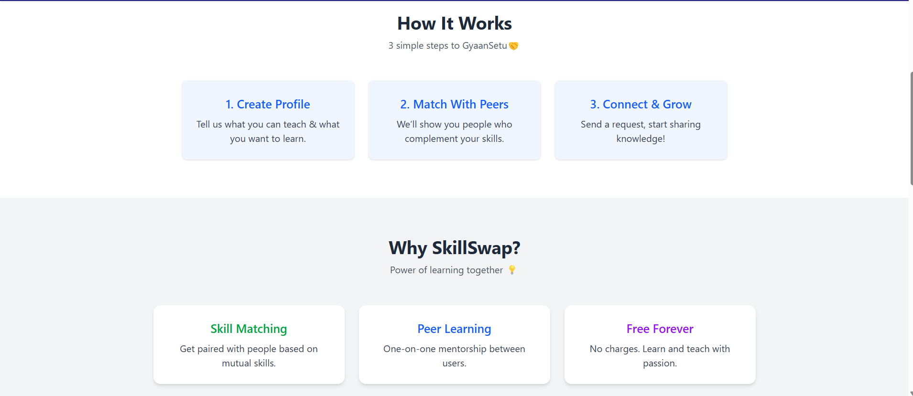
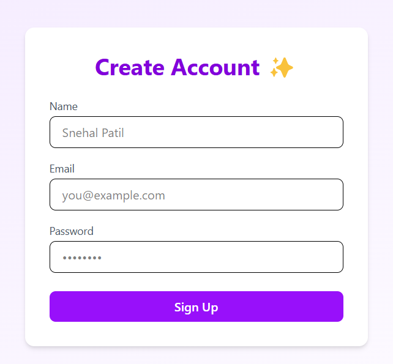
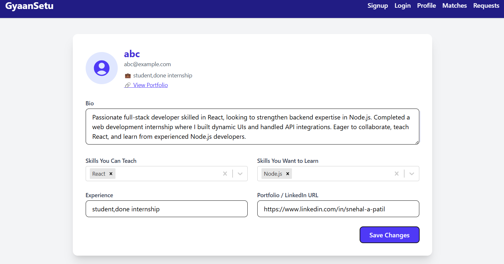
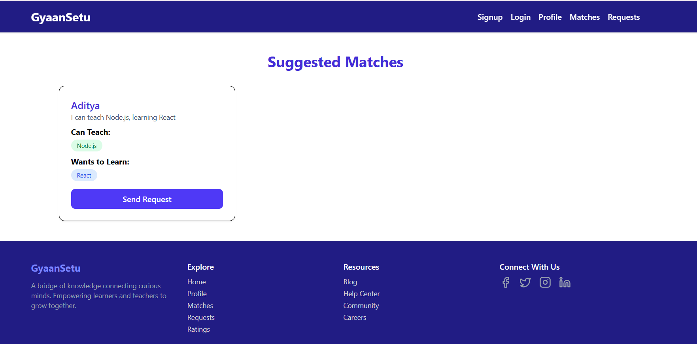
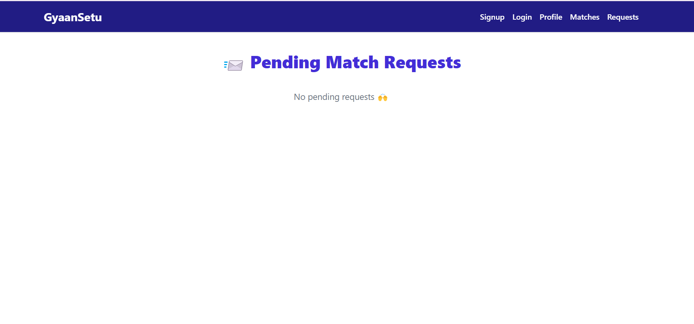

# 🌉 GyaanSetu

**GyaanSetu** is a full-stack MERN-based platform that acts as a bridge between learners and mentors. It intelligently matches users based on their skills to teach and learn, enables match requests, and allows real-time chat only after mutual consent — creating a focused and secure skill exchange environment.

---

## ✨ Features

- 🔐 **Secure Authentication** – JWT-based login and protected routes.
- 🎯 **Skill-Based Matching** – Matches users based on teach/learn compatibility.
- 📨 **Match Request Flow** – Users can send, accept, or reject match requests.
- 💬 **Real-Time Chat** – Built with Socket.IO, available post match acceptance.
- 👤 **User Profiles** – Includes bio, skills, experience, and portfolio.
- 📱 **Responsive UI** – Tailwind CSS powered modern and mobile-friendly design.

---

## 🛠️ Tech Stack

| Frontend     | Backend       | Real-Time | Database | Styling        |
|--------------|---------------|-----------|----------|----------------|
| React        | Node.js       | Socket.IO | MongoDB  | Tailwind CSS   |
| Axios        | Express.js    |           | Mongoose | React Icons    |
| React Router | JWT Auth      |           |          | Toastify       |

---

📸 Screenshots

